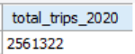
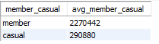
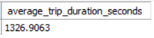
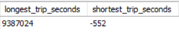
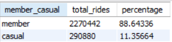
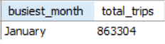
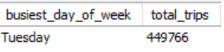
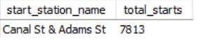
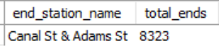

# Divvy Trip Data Analysis - 2020

## Project Overview

This project analyzes the Divvy bike trip data for the year 2020. The goal is to gain insights into usage patterns, rider behavior, and popular routes. The analysis was performed using SQL queries on a MySQL database, and the results are summarized below.

The original dataset was obtained from the Divvy trip data archives.

## Summary of Findings

Here is a summary of key insights derived from the data:

### General Statistics
* **Total Trips:** 2561322
* **Total Riders:** 2561322
* **Data Period:** January 1, 2020 - December 31, 2020

### Trip Duration
* **Average Trip Duration:** 1326.9063 seconds
* **Longest Trip:** 9387024 seconds
* **Shortest Trip:** -552 seconds

### Rider Demographics
* **Member vs. Casual Riders:**
    * **Member Trips:** 2270442 (88.64336%)
    * **Casual Trips:** 290880 (11.35664%)
* **Conclusion:** "Casual trips are a small portion of the total trips, suggesting that most riders are subscribers."

### Usage Patterns
* **Busiest Month:** January with 863304 trips.
* **Busiest Day of the Week:** Tuesday, followed by 449766.
* **Most Popular Starting Station:** Canal St & Adams St
* **Most Popular Ending Station:** Canal St & Adams St

### SQL Queries
The following SQL queries were used to generate the summary statistics.
**Calculate the Total_trip_2020.**

```sql
SELECT COUNT(*) AS total_trips_2020
FROM divvy_trip_2020;
```
### Result:
 

* <p> This query counts all the rows in the <code>divvy_trip_2020</code> table to get the total number of trips for the year 2020.</p> 
* <p>The <code>SELECT</code> statement uses <code>COUNT(*)</code> to count all rows in the <code>divvy_trip_2020</code> table.</p>
* <p>The <code>AS total_trips_2020</code> clause renames the column containing the count to <code>total_trips_2020</code><p>
* <p>As a result, the query returns the total number of trips recorded in the <code>divvy_trip_2020</code> table.</p>

**Calculate the average ride_length for members and casual riders.**

* **Rows = member_casual, Values = Average member_casual**

```sql
SELECT member_casual,count(*) AS avg_member_casual
FROM divvy_trip_2020 group by member_casual;
```
### Result:
 

* <p>This query groups the trips by <code>member_casual</code> and counts the number of trips for each category (member and casual). It incorrectly labels the result as "avg_member_casual" when it is actually a count.</p>

* <p>The <code>SELECT</code> statement selects the <code>member_casual</code> column and the count of trips for each category.</p>
* <p>The <code>count(*)</code> function counts the total number of trips for each group.</p>
* <p>The <code>GROUP BY member_casual</code> clause groups the results by the <code>member_casual</code> column, allowing the count to be calculated for each type of rider (member and casual).</p>
* <p>As a result, the query returns the total number of rides for each rider type, not the average ride length. The <code>AS avg_member_casual</code> alias is a misnomer.</p>

**Calculate the average Average Trip duration.**

```sql
SELECT AVG(TIMESTAMPDIFF(SECOND, started_at, ended_at)) AS average_trip_duration_seconds
FROM divvy_trip_2020;
```
### Result:
 

* <p>This query calculates the average trip duration in seconds by finding the difference between the <code>started_at</code> and <code>ended_at</code> timestamps for all trips.</p>

* <p>
The <code>SELECT</code> statement calculates the average of the trip duration.</p>
* <p>The <code>TIMESTAMPDIFF(SECOND, started_at, ended_at)</code> function calculates the duration of each trip in seconds by finding the difference between the <code>started_at</code> and <code>ended_at</code> timestamps</p>
* <p>The <code>AVG()</code> function then calculates the average of all these trip durations.</p>
* <p>The <code>AS average_trip_duration_seconds</code> clause renames the output column.</p>
* <p>As a result, the query provides the overall average trip duration in seconds for all trips.</p>
        
 **Calculate the longest and shortes trips.**

```sql
SELECT
    MAX(TIMESTAMPDIFF(SECOND, started_at, ended_at)) AS longest_trip_seconds,
    MIN(TIMESTAMPDIFF(SECOND, started_at, ended_at)) AS shortest_trip_seconds
FROM
    divvy_trip_2020;
```
### Result:
 

* <p>This query finds the maximum and minimum trip durations in seconds by calculating the difference between the <code>started_at</code> and <code>ended_at</code> timestamps for all trips.</p>
* <p>The <code>SELECT</code> statement calculates the maximum and minimum trip durations.</p>
* <p><code>MAX(TIMESTAMPDIFF(SECOND, started_at, ended_at))</code> finds the longest trip duration in seconds.</p>
* <p><code>MIN(TIMESTAMPDIFF(SECOND, started_at, ended_at))</code> finds the shortest trip duration in seconds.</p>
* <p>The <code>AS</code> clauses rename the output columns to <code>longest_trip_seconds</code> and <code>shortest_trip_seconds</code>.</p>
* <p>As a result, the query returns the duration of the single longest and single shortest trip in the dataset.</p>

**Calculate the total rides and percentage .**

```sql
WITH RideCounts AS (
    SELECT
        member_casual,
        COUNT(*) AS total_rides
    FROM
        divvy_trip_2020
    GROUP BY
        member_casual
)
SELECT
    member_casual,
    total_rides,
    (total_rides * 100.0 / (SELECT SUM(total_rides) FROM RideCounts)) AS percentage
FROM
    RideCounts;
```
### Result:
 

* <p>This query uses a Common Table Expression (CTE) named <code>RideCounts</code> to first count the total rides for each <code>member_casual</code> type. Then, it calculates the percentage of rides for each type by dividing their total rides by the overall total and multiplying by 100.</p>
* <p>The <code>WITH RideCounts AS (...)</code> clause creates a Common Table Expression (CTE) to first calculate the total number of rides for each <code>member_casual</code> type.</p>
* <p>The inner <code>SELECT</code> statement in the CTE groups the trips by <code>member_casual</code> and counts them.</p>
* <p>The final <code>SELECT</code> statement selects the <code>member_casual</code> type and its <code>total_rides</code> from the CTE.</p>
* <p>It then calculates the percentage for each group by dividing the group's <code>total_rides</code> by the total sum of all rides (found with the subquery <code>(SELECT SUM(total_rides) FROM RideCounts)</code>) and multiplying by <code>100.0</code> to ensure a floating-point result.</p>
* <p>As a result, the query shows the total number of rides for members and casual riders, along with the percentage of total rides each group represents.</p>

**Calculate the Busiest_month.**

```sql
SELECT
    MONTHNAME(started_at) AS busiest_month,
    COUNT(*) AS total_trips
FROM
    divvy_trip_2020
GROUP BY
    busiest_month
ORDER BY
    total_trips DESC
LIMIT 1;

```
### Result:
 

* <p>This query extracts the month name from the <code>started_at</code> timestamp, counts the number of trips for each month, and then orders the results in descending order to find the month with the most trips. It limits the result to the top one.</p>
* <p>The <code>SELECT</code> statement selects the month name and the count of trips for that month.</p>
* <p>The <code>MONTHNAME(started_at)</code> function extracts the name of the month from the <code>started_at</code>timestamp.</p>
* <p>The <code>GROUP BY busiest_month</code> clause groups the trips by month.</p>
* <p>The <code>ORDER BY total_trips DESC</code> clause sorts the results in descending order based on the number of trips.</p>
* <p>The <code>LIMIT 1</code> clause restricts the output to only the top row.</p>
* <p>As a result, the query identifies and returns the single month with the highest number of trips.</p>

**Calculate the Busiest_day_of_week.**

```sql
SELECT
    DAYNAME(started_at) AS busiest_day_of_week,
    COUNT(*) AS total_trips
FROM
    divvy_trip_2020
GROUP BY
    busiest_day_of_week
ORDER BY
    total_trips DESC
LIMIT 1;

```
### Result:
 

* <p>This query extracts the day name from the <code>started_at</code> timestamp, counts the number of trips for each day of the week, and then orders the results in descending order to find the busiest day. It limits the result to the top one.</p>
* <p>The <code>SELECT</code> statement selects the day name and the count of trips for that day.</p>
* <p>The <code>DAYNAME(started_at)</code> function extracts the name of the day of the week from the <code>started_at</code> timestamp.</p>
* <p>The <code>GROUP BY busiest_day_of_week</code> clause groups the trips by the day of the week.</p>
* <p>The <code>ORDER BY total_trips DESC</code> clause sorts the results in descending order based on the number of trips.</p>
* <p>The <code>LIMIT 1</code> clause restricts the output to only the top row.</p>
* <p>As a result, the query identifies and returns the single day of the week with the highest number of trips.</p>

**Calculate Most Popular Starting Station.**

```sql
SELECT
    start_station_name,
    COUNT(*) AS total_starts
FROM
    divvy_trip_2020
WHERE
    start_station_name IS NOT NULL
GROUP BY
    start_station_name
ORDER BY
    total_starts DESC
LIMIT 1;

```
### Result:
 

* <p>This query counts the number of trips starting at each station, ignoring trips with a null starting station. It then orders the results in descending order to find the most popular starting station and limits the result to the top one.</p>
* <p>The <code>SELECT</code> statement selects the station name and the count of trips originating from that station.</p>
* <p>The <code>WHERE start_station_name IS NOT NULL</code> clause filters out any trips where the starting station is not recorded.</p>
* <p>The <code>GROUP BY start_station_name</code> clause groups the trips by the starting station.</p>
* <p>The <code>ORDER BY total_starts DESC</code> clause sorts the results in descending order based on the number of starts.</p>
* <p>The <code>LIMIT 1</code> clause restricts the output to the single most popular starting station.</p>
* <p>As a result, the query returns the name of the starting station with the highest number of recorded trips.</p>

**Calculate Most Popular Ending Station.**

```sql
SELECT
    end_station_name,
    COUNT(*) AS total_ends
FROM
    divvy_trip_2020
WHERE
    end_station_name IS NOT NULL
GROUP BY
    end_station_name
ORDER BY
    total_ends DESC
LIMIT 1;

```
### Result:
 

* <p>This query counts the number of trips ending at each station, ignoring trips with a null ending station. It then orders the results in descending order to find the most popular ending station and limits the result to the top one.</p>
* <p>The <code>SELECT</code> statement selects the station name and the count of trips ending at that station.</p>
* <p>The <code>WHERE end_station_name IS NOT NULL</code> clause filters out any trips where the ending station is not recorded.</p>
* <p>The <code>GROUP BY end_station_name</code> clause groups the trips by the ending station.</p>
* <p>The <code>ORDER BY total_ends DESC</code> clause sorts the results in descending order based on the number of ends.</p>
* <p>The <code>LIMIT 1</code> clause restricts the output to the single most popular ending station.</p>
* <p>As a result, the query returns the name of the ending station with the highest number of recorded trips.</p>

 ---


## Summary of the Data

The analysis of Divvy trip data from 2020 provides a clear picture of the bike-sharing service's usage patterns during that year. The key findings indicate that the service is heavily dominated by **member riders**, who account for nearly 89% of all trips. This suggests that the majority of Divvy users are subscribers who likely use the service for regular, possibly commute-related, trips.

The analysis of trip duration highlights a wide range, from a negative value (an indication of a data quality issue) to extremely long rides. The average trip duration is approximately 22 minutes.

The usage patterns show that the service is used throughout the year, with a seemingly busiest month in January. However, this finding should be re-evaluated due to the unusual nature of a winter month being the busiest. The data also suggests that Tuesdays are the most popular day of the week for rides. The station located at Canal St & Adams St serves as both the most popular starting and ending point, which suggests a high volume of round-trip rides or a central hub for commuters.

